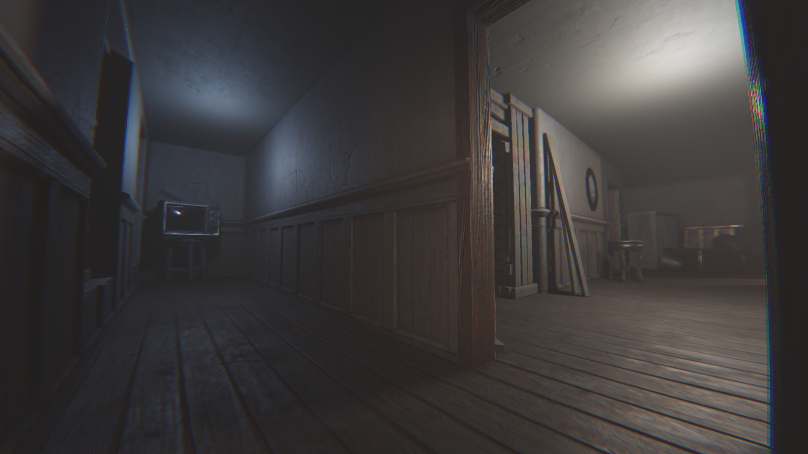

# Defold BRDF Deferred Rendering V2

Deferred rendering pipeline with PBR materials and post-processing effects for Defold Engine.

## Updates

### v2.01
1. Fixed flashlight position
2. Removed SSAO (it was too poor quality and GPU-intensive)
3. Reduced texture resolution to 512px

## Rendering Effects

### Deferred Pipeline
- **GBuffer** — geometry buffer (albedo, normals, roughness, depth)
- **DepthPass** — depth rendering for shadow maps
- **TiledLighting** — lighting optimization through tile-based light culling
- **LightingPass** — main lighting pass with shadows (EEVEE-like lighting)
- **VolumetricLighting** — volumetric light scattering (atmospheric light rays)
- **CombinePass** — final composition (lighting + glass)

### Post-Processing
- **FisheyeAberration** — fisheye distortion + chromatic aberration
- **FidelityFX FSR** — AMD FidelityFX Super Resolution (EASU + RCAS) for upscaling and sharpening (disabled at demo)

## Technical Details

### Shadows

The pipeline implements **cubemap shadow mapping** with soft shadows for point and spot lights:

- **Shadow Atlas**: 2000×2000 texture containing multiple cubemap shadow maps (200×200 per cube face)
- **Soft Shadows**: Stochastic PCF (Percentage Closer Filtering) with 12 Poisson disk samples per pixel
- **Seamless Transitions**: Spherical PCF sampling ensures smooth transitions between cube faces without visible seams
- **Gnomonic Distortion Compensation**: UV offsets are adjusted to maintain constant angular step size, preventing sampling artifacts at cube face edges
- **Dynamic Bias**: Combines constant bias (~0.35 texels) with slope-dependent bias (up to ~1 texel) based on surface normal and light direction to prevent shadow acne
- **Face Stitching**: Automatic handling of samples that cross cube face boundaries by reconstructing direction and selecting the correct adjacent face

### Tiled Lighting

**Tile-based light culling** optimization reduces per-pixel light evaluation overhead:

- **Tile Grid**: Screen is divided into tiles (approximately 10×10 pixels per tile)
- **Light Masks**: Each tile stores a 24-bit bitmask indicating which lights affect that tile region
- **Mask Generation**: TiledLighting pass evaluates all lights per tile, computes shadows, and encodes active light indices into a bitmask stored in R32F texture format
- **3×3 Gathering**: During lighting pass, each pixel reads masks from a 3×3 neighborhood of tiles and combines them (OR operation) to handle light sources near tile boundaries
- **Bit Iteration**: Uses de Bruijn sequence for efficient bit scanning to iterate only over active lights
- **Performance**: Instead of checking all 32 lights per pixel, only lights marked in the tile mask are evaluated, significantly reducing shader complexity

### Other Features

- **PBR Materials**: Support for albedo, normal, roughness, and emissive maps
- **Tonemapping**: ACES, AGX (approximated and LUT-based)
- **Light Support**: Up to 32 light sources (point, spot)
- **BRDF**: GGX specular with Smith-G visibility term, Burley diffuse (Disney principled)

## Architecture

### Multi-Level Rendering Pipeline

The rendering pipeline is implemented in **level scripts** rather than centralized in the render script. This design allows each level to have its own independent rendering pipeline and set of light sources.

**Architecture Overview:**

- **Render Script** (`render.render_script`): 
  - Provides minimal centralized initialization (viewport, toolkit, predicates)
  - Iterates through all registered worlds and calls their render functions
  - Acts as a coordinator rather than implementing the full pipeline

- **Core System** (`Core.lua`):
  - Manages multiple independent "worlds" (levels)
  - Each world is registered via `Core:world(init_callback, update_callback)`
  - Worlds are stored in an array and can be queried via `Core:get_worlds()`

- **World System** (`World.lua`):
  - Each world maintains its own:
    - **Light sources**: Independent `light_source_flat_arrays` (transform, color, properties)
    - **Cameras**: Per-world camera management
    - **Render targets**: Stored in `props` (GBuffer, lighting buffers, shadow maps, etc.)
  - Initialization: `init_callback` creates render targets and configures the pipeline
  - Rendering: `update_callback` executes the full deferred pipeline for that world

- **Level Script** (e.g., `Scene.script`):
  - Registers a world with `Core:world()`
  - Defines the complete rendering pipeline in `update_callback`:
    - GBuffer pass → TiledLighting → LightingPass → Glass → Combine → Post-processing
  - Each level can customize its pipeline, effects, and light configuration

**Benefits:**
- **Flexibility**: Different levels can use different rendering pipelines
- **Isolation**: Each level's lights and render targets are independent
- **Scalability**: Easy to add new levels with custom rendering setups
- **Modularity**: Levels can be loaded/unloaded without affecting others

**Current State:**
This implementation is **halfway complete** and should be treated as a **demo** rather than a production-ready reference. The foundation for multi-level rendering is in place, but the architecture could be further refined for better separation of concerns and adherence to Defold Engine best practices.

## Known Issues

### Web Export - Physics Listener

**Issue**: Web export requires disabling physics collision handling with the world.

**Workaround**: Comment out the `physics.set_listener` call in `src/Modules/Core/Modules/World.lua` to make web export work:

```lua
-- Comment this out for web export:
-- physics.set_listener(function(_, event, data)
--     this.physics_master:update(event, data)
-- end)
```

**Location**: `src/Modules/Core/Modules/World.lua`, line 38-40
